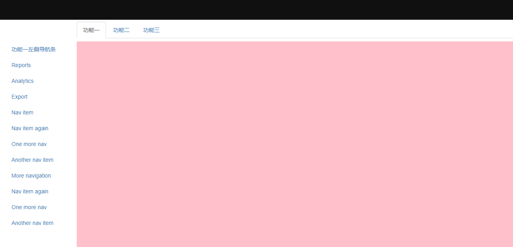

## node + express + ejs + bootstrap 简易后台布局
### （一） 安装使用
1、下载该项目  
2、安装supervisor：npm -g install supervisor （用于修改保存后自动启动服务）  
3、node run dev 运行项目  
4、访问 127.0.0.1:3000 即可看到该项目号

---

### （二） 项目预览界面

